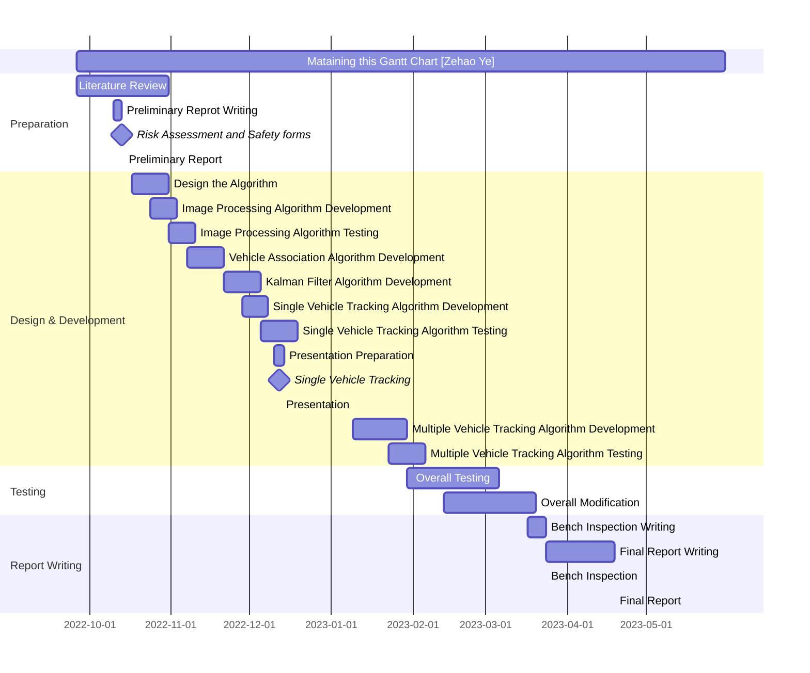

# ELEC340 Final-Year-Project
 *Vehicle-Tracking-In-Large-Area-Video* 

## Introduction

This project will be concerned with developing tracking algorithms for detecting and creating a track for specific vehicles through a complex urban environment. This project will use existing video simulations ([example](https://stream.liv.ac.uk/zbj9sswg)) showing complex environments where vehicles are occluded as an air vehicle moves through a city. The processing steps of the project can be seperated into three parts, which are image handling, vehicle detection and tracking.

+ **Image Handling** ——— the vehicle would move from one square of the image to the other square of image while tracking. In hence, the right square of image (time dependent) need to be load from the file.

+ **Object / Vehicle Tracking** —— the vehicle detection requires corresponding algorithms for motion detection, and the template matching method are demanded to match the corresponding features with target vehicle.

+ **Tracking** —— application of Kalman Filter and Particle Filter

## Gannt Chart

