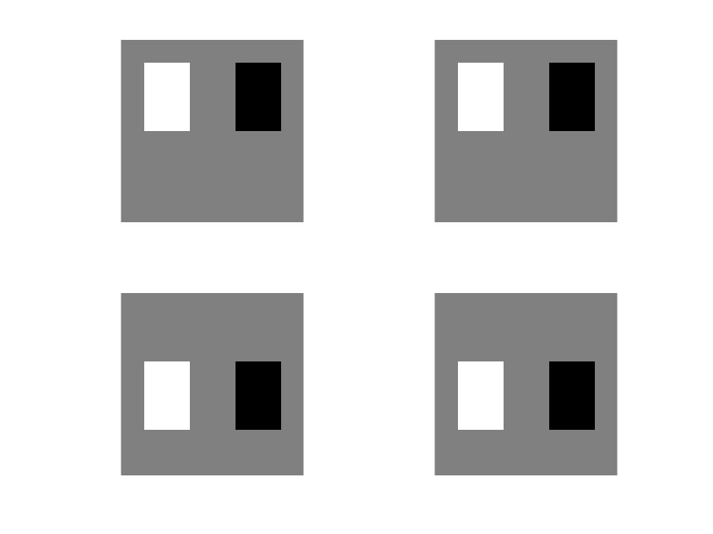
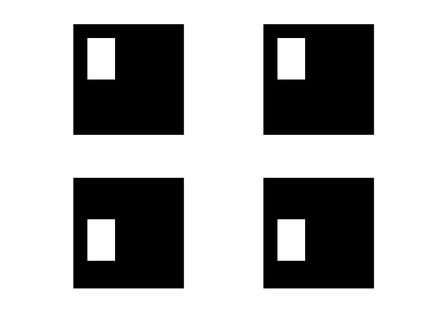

# Testing Method
The location information about the vehicles are numerous, which means it would spend a large amount time to label all the vehicle by frames. Sampling investigation would be a better way to calculate the error in this test. The sampling method is shown as follow. Ramdomly Select a video and sample the random frames of the video. The vehicle information is annotated and compared with the image processing results to calculate the corresponding error and accuracy

# Sampling result
+ Video 2.5_2_4 Frame 51
  |Vehcile|Measurement|Labelled|Error|
  |:-|:-|:-|:-|
  |1|1339.557,1656.663|1331,1656|8.557, 0.663|
+ Video 2.5_2_4 Frame 101
  |Vehcile|Measurement|Labelled|Error|
  |:-|:-|:-|:-|
  |1|482.853, 1887.118|483, 1887|-0.147, 0.118|
  |2|1264.732, 1024.008|1263, 1024|1.732, 0.008|
  |3|1337.494, 1028.288|1337, 1028|0.494, 0.288|
  |4|1361.405, 1344.415|1347, 1342|14.405, 2.415|
  |5|1377.678, 1043.872|1390,	1045|-12.322, -1.128|
  |6|1480.647, 1037.429|1479.500, 1037.500|1.147, -0.0710|

+ Video 2.5_2_4 Frame 370
  |Vehcile|Measurement|Labelled|Error|
  |:-|:-|:-|:-|
  |1|8.738, 228.647|7, 229|1.738, -0.353|
  |2|46.942, 792.201|58, 792|-11.058,0.201|
  |3|46.942, 792.201|58, 792|-11.058, 0.201|
  |4|114, 97|116, 100|-2, -3|
  |5|120.012, 161.492|119, 162|1.012, -0.508|
  |6|118.205, 1914.487|119, 1904|-0.795, 10.487|
  |7|120.302, 1891.883|119, 1904|1.302, -12.117|
  |8|242.945,120.869|244,120|-1.055,0.869|
  |9|520.636,31.848|526,30|-5.364,1.848|
  |10|775.5,1603.5|778,1608|-2.5,-4.5|
  |11|794.12,1648.88|794,1647|0.12,1.88|
  |12|804.008,1671.543|810,1686|-5.992,-14.457|
  |13|1020.447,1281.724|1018.5,1284|1.947,-2.276|
  |14|1024.853,1202.853|1024,1206|0.853,-3.147|
  |15|1041.162,1186.338|1042,1186|-0.838,0.338|
  |16|1069.634,1077.39|1071,1078|-1.366,-0.61|
  |17|1074.398,1018.211|1080,1005|-5.602,13.211|
  |18|1101.203,1926.61|1101,1931|0.203,-4.39|
  |19|1103.154,1906.457|1099,1904|4.154,2.457|
  |20|1108.538,1752.4130|1111,1738|-2.463,14.412|
  |21|1125.66,911.708|1125,921|0.66,-9.292|
  |22|1152.211,1625.022|1161,1626|-8.789,-0.978|
  |23|1157.311,177|1155,177|2.311,0|
  |24|1153.848,1364.1520|1155,1360|-1.152,4.152|
  |25|1169.119,1113.678|1169,1114|0.119,-0.322|
  |26|1187.931,719.478|1188,719|-0.069,0.478|
  |27|1195.462,1316.491|1206,1317.5|-10.538,-1.009|
  |28|1201,1629|1204,1629|-3,0|
  |29|1236.082,572.796|1229,593|7.082,-20.204|
  |30|1235,1022|1245,1022|-10,0|
  |31|1237.529,524.841|1238,22|-0.471,2.841|
  |32|1236.5,1632.5|1244,1633|-7.5,-0.5|
  |33|1251,1322.5|1246,1321|5	1.5|
  |34|1275.651,1323.172|1285,1323|-9.349,0.172|
  |35|1299.5,1026|1303,1026|-3.5,0|
  |36|1300.5,1639.5|1295,1639|5.5,0.5|
  |37|1325.617,312.617|1328,308|-2.383,4.617|
  |38|1358,1030|1362,103|-4,0|
  |39|1384.754,159.129|1388,154|-3.246,5.129|
  |40|1417.877,1335.637|1422,1336|-4.123,-0.363|
  |41|1426.719,1034.53|1425,1034|1.719,0.53|
  

  ||X|Y|
  |:-:|:-:|:-:|
  |Mean|$\overline{x} = -1.835825$|$\overline{y} = -0.3101$|
  |Absolute Mean|$\overline{\|x\|} = 3.521825$|$\overline{\|y\|} = 3.5912$|
  |Standard Deviation|$\sigma_x = 4.384838$|$\sigma_y = 6.192274$|\
  |Standard Deviation for absolute value|$\hat{\sigma_x} = 3.156295$|$\hat{\sigma_y} = 5.021502$|
  


# Analysis
## The deviation between vehicle centre and tracking centre
+ The colour of vehicles: The grayscale image in MATLAB is 8-Byte grayscale, the value of the image would range from 0-255. In hence, we can assume that the value of the environment is 20. Vehicles with lighter colours appear white in the greyscale image, while vehicles with darker colours appear black in the greyscale image. To facilitate the distinction, we assume that the vehicles are pure white and pure black respectively, and their values in the greyscale image are 255(white) and 0(black). The result can be displayed by generating image through created matrices in MATLAB. The results are shown as follow.
  ````
  env1 = 30 * ones(8); 
  env2 = 10 * ones(8);
  w = 224; b = 1;

  white1=[0 0 0 0 0 0 0 0;
          0 w w w w 0 0 0;
          0 w w w w 0 0 0;
          0 w w w w 0 0 0;
          0 0 0 0 0 0 0 0;
          0 0 0 0 0 0 0 0;
          0 0 0 0 0 0 0 0;
          0 0 0 0 0 0 0 0;];
  white2=[0 0 0 0 0 0 0 0;
          0 0 0 w w w w 0;
          0 0 0 w w w w 0;
          0 0 0 w w w w 0;
          0 0 0 0 0 0 0 0;
          0 0 0 0 0 0 0 0;
          0 0 0 0 0 0 0 0;
          0 0 0 0 0 0 0 0;];
  black1=[0 0 0 0 0 0 0 0;
          0 0 0 0 0 0 0 0;
          0 0 0 0 0 0 0 0;
          0 b b b b 0 0 0;
          0 b b b b 0 0 0;
          0 b b b b 0 0 0;
          0 0 0 0 0 0 0 0;
          0 0 0 0 0 0 0 0;];
  black2=[0 0 0 0 0 0 0 0;
          0 0 0 0 0 0 0 0;
          0 0 0 0 0 0 0 0;
          0 0 0 b b b b 0;
          0 0 0 b b b b 0;
          0 0 0 b b b b 0;
          0 0 0 0 0 0 0 0;
          0 0 0 0 0 0 0 0;];
  ```` 
  + subtraction calculation and  result comparison
  ````
  whitet1 = (white1+env1)-(white2+env1); 
  whitet2 = (white1+env2)-(white2+env2);
  blackt1 = (black1+env1)-(black2+env1); 
  blackt2 = (black1+env2)-(black2+env2);
  I_w1 = mat2gray(whitet1); 
  I_w2 = mat2gray(whitet2);
  I_b1 = mat2gray(blackt1); 
  I_b2 = mat2gray(blackt2);

  figure,
  subplot(2,2,1);imshow(I_w1);
  subplot(2,2,2);imshow(I_w2);
  subplot(2,2,3);imshow(I_b1);
  subplot(2,2,4);imshow(I_b2);
  saveas(gcf,'comparison_subtraction_first.jpg', 'jpg')
  ````
  
  + For the first image, the subtraction of the matrices are made firstly, then the matrices are converted into image. In the process of transforming the grayscale image, the MATLAB programme automonously performs histogram equivalization. The positive and negative values of the subtraction of the two frames are represented simultaneously in the grayscale image.

  
  + For the second image, the matrices are firstly convert into images and the images are used to make subtraction. In hence, only the positive value (where the car in the former frame) is displayed.

  According to the result, the colour of vehicles would not influence the tracking result. In reality, the However, the deviation between vehicle centre and tracking centre still exist. The influence of the vehicle size need to be take into account.

+ The size of vehicles: 
+ The speed of vehicles:

