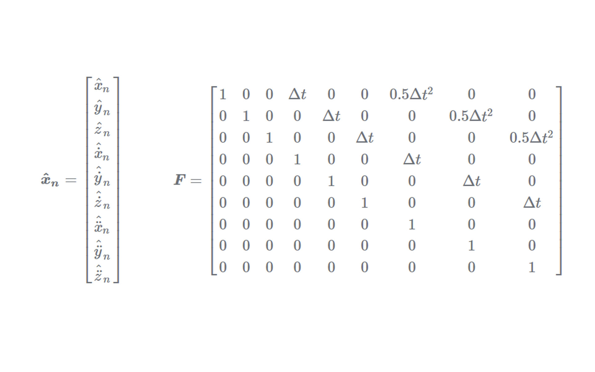
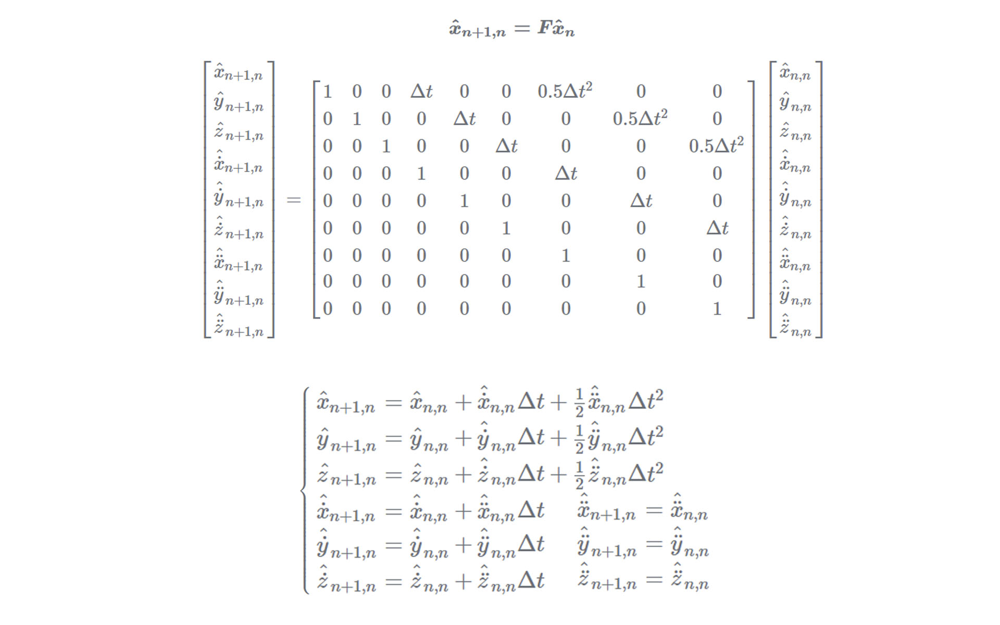

### This is a note about the reference, relevant knowledge which are mentioned would be write in this note as well. 

# 1. Kalman Filter
## 1.1. State Update Equation
The following equation is `State Update Equation`, which is used to estimate the state of static system. The characteristic of static system is that the true value of the system is still.

$$
\hat{x_{n,n}}=\hat{x_{n,n-1}}+\frac{1}{n}*(z_n-\hat{x}_{n,n-1})
$$

+ $\hat{x}_{n,n}$: the estimate state of `x` at the time `n` based on the measurement at time `n`
+ $\hat{x}_{n,n-1}$: the estimate state of `x` at the time `n` based on the measurement at time `n-1`
+ $\frac{1}{n}$: Kalman Gain $K_n=\frac{1}{n}$, can also be written as $a_n$
+ $z_n$: the meausurement

## 1.2. State Extrapolation Equation
To explain this equation, we are going to track a **constant-velocity** aircraft in **one dimension** using the α-β filter. In this system, the dynamic equation (Uniform Linear Motion Equation) is:

$$
x_{n+1}=x_{n}+\Delta t*\dot{x}_n
$$ 

The update equation which is used to track the aircraft is called `α−β track update equations` or `α−β track filtering equations`.

+ The Update State Equation for position:

$$\hat{x}_{n,n}=\hat{x}_{n,n-1}+\frac{1}{n}*(z_n-\hat{x}_{n,n-1})  $$
  
+ The Update State Equation for velocity:
  
$$\hat{\dot{x}}_{n,n}=\hat{\dot{x}}_{n,n-1}+\beta*(\frac{z_n-\hat{x}_{n,n-1}}{\Delta t})$$

## 1.3. Dynamic Model Equation (α−β−γ Filter)
In this example, we are going to track an aircraft that is moving with `constant acceleration` in `one dimension` with the α−β−γ filter. The update equations about position, velocity and acceleration are shown as follow: 

$$\hat{x}_{n,n}=\hat{x}_{n,n-1}+\alpha*(z_n-\hat{x}_{n,n-1})$$

$$\hat{\dot{x}}_{n,n}=\hat{\dot{x}}_{n,n-1}+\beta*(\frac{z_n-\hat{x}_{n,n-1}}{\Delta t})$$

$$\hat{\ddot{x}}_{n,n}=\hat{\ddot{x}}_{n,n-1}+\gamma*(\frac{z_n-\hat{x}_{n,n-1}}{0.5* \Delta t^2})$$

## 1.4. Kalman Gain Equation

$$K_n=\frac{p_{n,n-1}}{p_{n,n-1}+r_n}$$

+ $r_n$: the measurement uncertainty
+ $p_{n,n-1}$: the extrapolated estimate uncertainty,  the estimate uncertainty of `p` at the time `n` based on the measurement at time `n-1`

## 1.5. Kalman Filter for Multi-Dimension
The matrixs about the multi-dimension are shown as follow:

These equations about the matrixs can be simplified as `state exploration equation`.  
$$\hat{x}_{n+1,n}=F*\hat{x}_{n,n}+G*\hat{u}_{n,n}+\omega_n$$
+ $F$: state transition matrix  
+ $G$: input transition matrix  

The depreciation rate is 5%. (effective in six years)

$total = CONTROL+BOOSTER+EGIL+NETWORK+WEATHER+PAYLOAD = 156600$ 
|CONTROL|BOOSTER|EGIL|NETWORK|WEATHER|PAYLOAD|TOTAL|
|:-:|:-:|:-:|:-:|:-:|:-:|:-:|
|4300|50000|2500|11800|23000|65000|156600|

# Method 1:
+ End of year 1.0: $value = £156.6k - 5\% * £156.6k = £148.8k$
+ End of year 2.0: $value = £148.8k - 5\% * £148.8k = £141.3k$
+ End of year 3.0: $value = £141.3k - 5\% * £141.3k = £134.3k$
+ End of year 3.5: $value = £134.3k - (5\% * £134.3k)/2 = £130.9k$

# Method 2:
+ End of year 3.5: $value = £156.6k* (1-5\%)^{3.5} = £130.9k$
